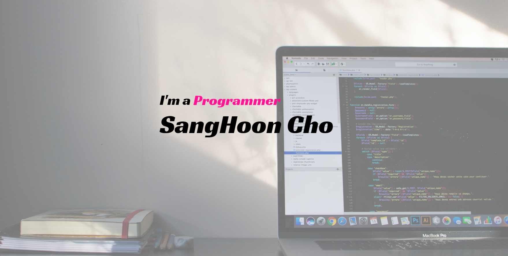
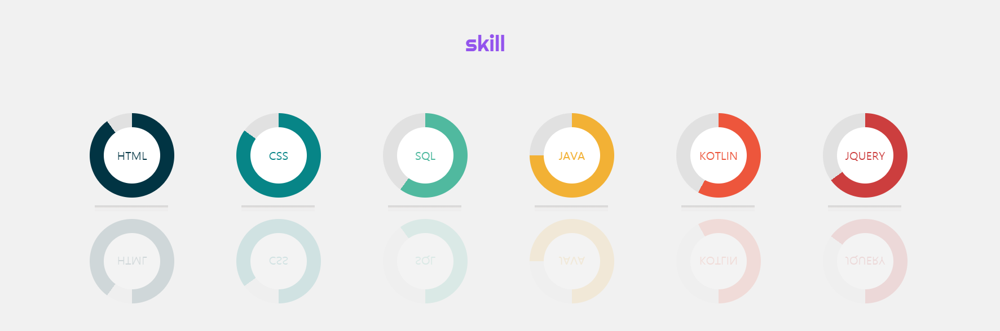
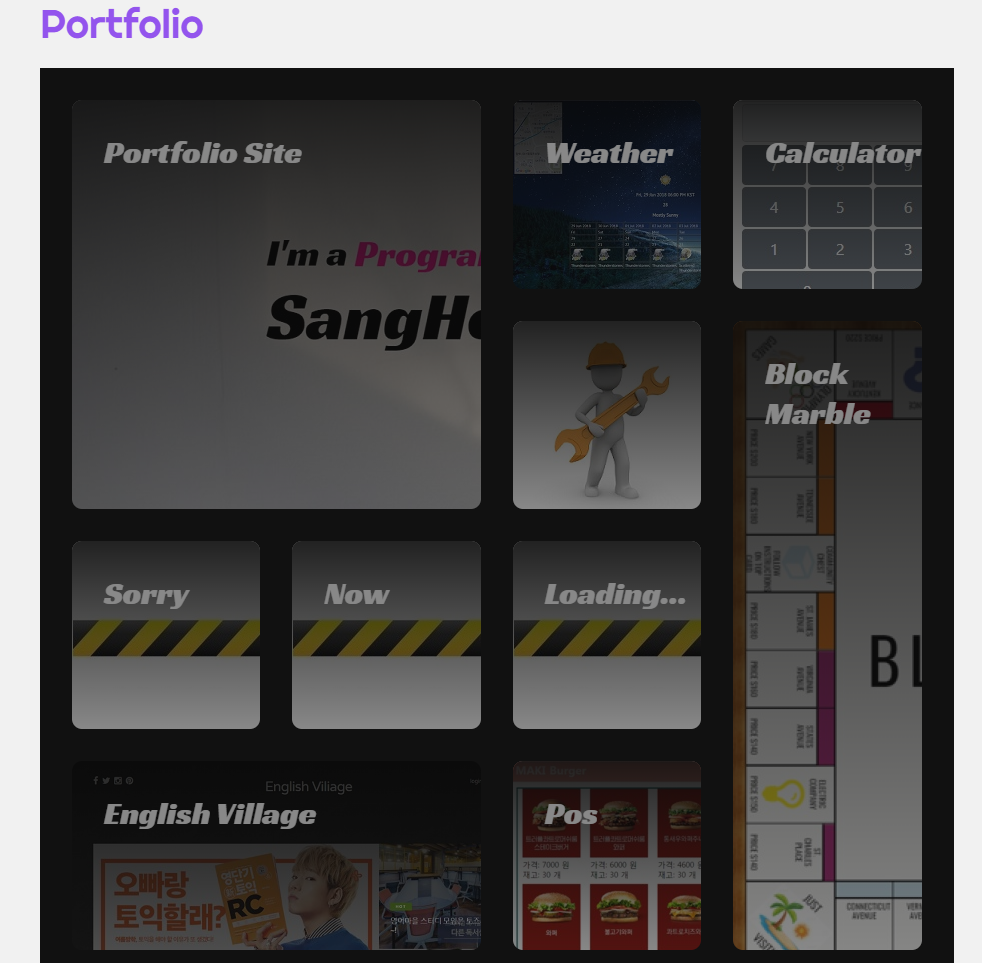
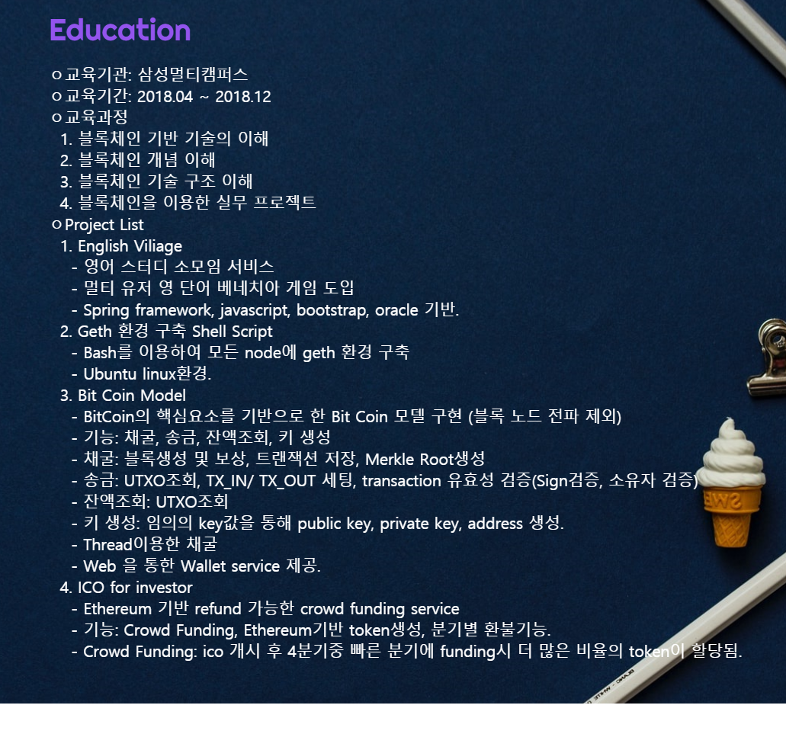

# Portfolio
자기소개를 하기 위한 홈페이지 입니다.

## 프로젝트 소개
이 사이트는 저를 소개하기위한 포트폴리오 사이트 입니다. 
제가 구현을 할 수 있는 것들이 무엇들인지 보여드리기 위해 부트스트랩의 도움없이 제작을 하였습니다. 
HTML과 CSS를 연습하고 웹에 더 익숙해지고자 작업한 페이지입니다.

## 작업 환경
- 언어 : JavaScript, HTML, CSS
- 개발도구 : 이클립스
- 운영체제 : Windows
- 형상관리 : git, github

## 구현 화면

