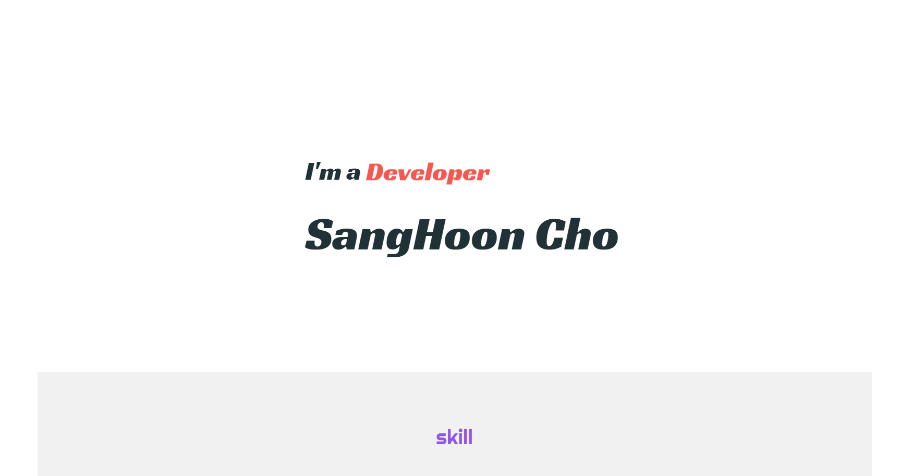

# Portfolio
자기소개를 하기 위한 홈페이지 입니다.

## 프로젝트 소개
이 사이트는 저를 소개하기위한 포트폴리오 사이트 입니다. 
제가 구현을 할 수 있는 것들이 무엇들인지 보여드리기 위해 순수 자바스크립트를 이용하여 작업 하였습니다.

## 작업 환경
- 언어 : JavaScript, HTML, CSS
- 개발도구 : 이클립스, Visual Studio Code
- 운영체제 : Windows
- 형상관리 : git, github

## 구현 화면

